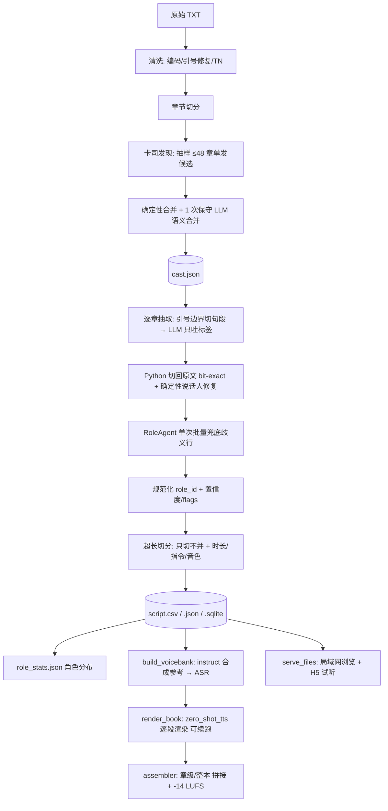

# 小说整本 → 有声书 工作流

核心原则：**把全部不确定性前置到「剧本」，渲染端退化成无状态纯函数**。渲染时不再做 ASR / 角色判断 / 时长估算，出错一定能定位到剧本某一行。面向 AuK 开发，指令模板与 AuK 现有任务对齐。

> 状态：前端（清洗→定角→抽取→剧本→统计）与后端（voicebank→逐段渲染→组装）均已实现并跑通 20 章。
> 代码：`audiobook/` 包；CLI：`scripts/build_script.py`、`scripts/role_stats.py`、`scripts/build_voicebank.py`、`scripts/render_book.py`。

## 1. 术语表

| 术语 | 英文 | 定义 |
| --- | --- | --- |
| 语料清洗 | Corpus Cleaning | 编码探测、换行统一、去页眉页脚、引号修复 |
| 章节切分 | Chapter Split | 按「第X章/卷/节」等标题切分 |
| 文本规范化 | Text Normalization (TN) | 转可朗读文本；保留 `raw_text` |
| 卡司（全局） | Cast / Role Registry | 全局唯一 `role_id`、别名、范例、音色档案 |
| 卡司合并 | Cast Consolidation | 确定性同名/核心名合并 + 一次保守 LLM 语义合并 |
| 角色规范化 | Role Canonicalization | 把同一角色被拆开的多个 `role_id` 归一 |
| 句段 | Span | 引号边界切出的「纯叙述」或「纯对白」片段 |
| 话语单元 | Utterance Unit (U) | 同角色同 kind 的连续句段合并结果 |
| 剧本 | Script / Storyboard | 有序 U 表（CSV/SQLite），承载全部合成字段 |
| 角色分布 | Role Distribution | 只统计「会说话」角色；有名字但无对白者排除 |
| 音色库 | Voice Bank | 每个角色一段「性格描述+台词」合成参考 + ASR |
| 指令渲染 | Instruction Rendering | 按 AuK 模板机械拼出 `pe_instruction` |
| 渲染 | Rendering | `row → wav`，纯函数、无 NLP、可续跑 |
| 组装/母带 | Assembly / Mastering | 按序拼接、边界 gap、响度归一 |

## 2. 主流程图



## 3. 阶段细化

1. **清洗**（`cleaning.py`）：编码探测（UTF-8/GBK/Big5/UTF-16/UTF-16）、去空段、`repair_quotes`（ASCII 引号→中文、按段补全未闭合引号）。产物 `clean.txt`。
2. **章节切分**：正则匹配 `第X[章节回卷篇部]` / `Chapter N` / `序章/前言/番外`；无标题则整本作一章。
3. **卡司发现**（`cast.py::discover_cast`）：**抽样**（前 12 章 + 均匀间隔，默认 ≤48 章，不再是每章一次）单发候选；`thinking off`。
4. **卡司合并**：`Cast.merge_candidates`（精确同名/别名）→ `Cast.consolidate`（**核心名**精确 + 子串合并 + 去头衔/分隔符）→ `consolidate_cast`（**一次保守 LLM 语义合并**，带「原始角色不得丢失」校验网）→ `_normalize_names`（去掉 `高文（高文·塞西尔）` 这类复合名）。
5. **逐章抽取（变体 C）**（`extract.py`）：`split_sentences` 按**引号边界**切成「纯叙述 / 纯对白」句段（行内短引用词不拆、纯标点碎片并入邻段）；LLM **只输出每段 `kind/role` 标签**，Python 按编号切回原文（fidelity=1.000）。
6. **确定性说话人修复**（`_repair_speakers`）：冒号引出 / `说·道` 动词 / 群像词→旁白；取**最早提及**角色；强信号覆盖模型标签；`narration` 一律归旁白。
7. **歧义兜底**（`agent.py::RoleAgent`）：对仍为 `dialogue+旁白` 的行做**单次批量**判定（实测自主多步 loop 在 9B 上不可靠，故改为一次批量 + 确定性工具收集上下文）。
8. **规范化**（`canonical.py::canonicalize_rows`）：按卡司解析 + 核心名包含关系，把被拆开的同一角色合并成一个 `role_id`。
9. **超长切分 + 时长/指令/音色绑定**（`duration.py`/`instructions.py`/`pipeline.py`）：见 §5、§6。
10. **角色分布**（`stats.py`）：只统计会说话角色，见 §10。
11. **音色库**（`voicebank.py`）：见 §6.2。
12. **渲染**（`renderer.py`）：`zero_shot_tts` 逐行 → `render/rows/<seg_id>__<hash>.wav`，**可续跑**（hash 命中即跳过）。
13. **组装**（`assembler.py`）：按 kind/角色切换插入 gap，响度 -14 LUFS、峰值 ≤0.95、24 kHz，PCM16。

## 4. 单元粒度与分句规则（实现版）

> 方案02 起，长难句切分改由 **LLM** 做（`audiobook/segment.py`）：>6s 的单元送给断句 agent，按语义切成短句；**只切分、不新增标点**（模型加的标点一律丢弃，`tts_text` 用原文切片），`raw_text` 保真；<1.5s 的碎片并回前段；校验"字序列一致"（骨架匹配，容忍标点差异），失败则回退确定性切分。`AUDIOBOOK_MAX_UNIT_SECONDS`/`AUDIOBOOK_SEGMENT_MIN_SECONDS` 可调。

- `split_sentences` 以**引号深度**切句段：
  - 开放引号前 flush 叙述段；闭合引号后 flush 对白段；引号内遇到弱标点**不切**。
  - **行内引用词**（前缀非冒号/说话动词、长度 ≤20、不以强标点结尾）不拆，留在叙述里（如 `能在“面见老祖”所带来的`）。
  - 纯标点碎片（如独立 `……`）并入上一段。
- `_group_units`：同 `kind` + 同 `role` + 同段落的连续句段合并为一个 U。
- 时长/长度：默认 **U 以 20s 为上限**，超长在 `segment_tts_text` 按标点分层切（只切不并）；不允许以弱标点结尾（补 `。`，`punct_edited=True`）。
- 上限：`MAX_SEGMENT_SECONDS=20`；纯中文硬上限 `20/0.22≈90` 字 → 留余量 `MAX_SEG_CHARS_ZH=80`；英文 `MAX_SEG_WORDS_EN=45`；最终闸门 `estimate_text_duration(tts_text) ≤ 20s`。

## 5. 时长估算

以 `app/infer_gradio.py` 的本地估算器为准（`audiobook/duration.py` 镜像，保持同步）：

| 项 | 系数 |
| --- | --- |
| 中文字 | 0.22 s/字 |
| 英文词 | 0.40 s/词 |
| 强停顿 `。！？!?…` | 0.30 s |
| 弱停顿 `，、；：,;:` | 0.12 s |

`target_duration_s = estimate_text_duration(tts_text)`，直接作为 AuK `gen_seconds`（`duration_source=est`）。渲染端不再算时长。

## 6. 指令渲染与音色

### 6.1 指令

- 所有角色（含 `narrator`）统一走 **`zero_shot_tts`** + 固定参考音频（`instruct_tts` 音色随机，不能固定角色）。
- 机械模板（`instructions.py`）：
  - 克隆：`Say the following with the same voice: "{text}"`
  - 文本合成（仅用于造参考音）：`请基于下面的描述: "{style_desc}",生成语音内容"{text}".`
  - 情感：`将情感转变为{emotion}。`
- `pe_instruction` 在剧本阶段定稿，渲染端只读。

### 6.2 音色库（`voicebank.py`）—— 无真人素材的引导法

1. 用角色的 `style_desc`（缺省用 `description`）+ 其**第一句范例台词**，走 `instruct_tts` 合成一段参考音；
2. 用 **faster-whisper**（`Asr`）ASR 出参考文本；
3. 之后该角色所有行都用 `zero_shot_tts` **克隆这段参考音** → 音色稳定且贴合人设。

产物：`references/<role_id>.wav`、`voicebank.json`（角色名→wav）、`voicebank_meta.json`（含 `ref_text`）。
`build_voicebank.py --script script.csv` 只给「会说话的角色」造参考音。

**参考音规范**：用真实资产（`assets/voice-reference/`）时，统一经 `scripts/prepare_refs.py` 预处理为 **24 kHz 单声道、≤12s**（去首尾静音 + 淡出）。AuK 内部会把任意采样率重采样到 24k（`infer_auk.py`），预处理后即免重采样、更一致。参考音**不宜过长**：输出时长由 `gen_seconds` 决定，但条件张量是「参考 latent + 目标 latent」拼接，参考越长显存/计算越大、越不稳；5–12s 为宜，<3s 音色不稳。`prepare_refs.py --map ROLE=PATH … --out refs --voices voices.json` 产出 `voices.json`（角色名→wav）供 `render_book.py --voices` 使用。

### 6.3 参考音优化与输出响度（实测 2026-09-13）

- **AuK 无音量/响度入参**：`AukInfer.generate()` 只有 `audio/gen_seconds/nfe/cfg/seed/sway/t_grid`，没有增益或目标响度；`_load_audio` 算了 `ref_rms` 但 `_run` 未使用（注释明说 skip output RMS restore），所以克隆输出电平很低（实测参考 -13 LUFS → 克隆 **-38 LUFS**，差 ~25dB）。原生 `volume_edit` 只有 ±5/10/15dB 档位、且要多跑一次模型，达不到精确目标。
  - **对策**：我们自己归一。`RenderConfig.target_lufs`（默认 **-16 LUFS**）在渲染每行后归一（`renderer.py`），assembler 母带同样归一；CLI `render_book.py --target-lufs`（`--no-normalize` 可关）。峰值 ceiling 0.95，短片段/测不出响度时回退峰值归一。
- **参考音优化只能用 `improve_quality/bandwidth_extension`**（bwe，补高频/提清晰度），实测电平稳定（源 -12.95 → -13.53 LUFS），主观可接受。
- **AuK 去混响是坏的**：`enhance_speech/dereverb` 与 `improve_quality/remove_effect`(effect=混响) 两个精确变体都把输出打到 **-42 LUFS / peak 0.04（近静音）**，不可用；所以"先去了再混回一点"没有意义。
- **AuK 降噪收益很小**：`enhance_speech/denoise` 精确变体只把 SNR 提高 ~1.3dB（8.2→9.5），不值得为它多跑一遍模型。
- 结论：参考音流水线 = `prepare_refs.py`（**VAD 去内部静音** + 去首尾静音 + 归一 + ≤12s）+ `optimize_refs.py`（bwe，一次性）；**不**做 AuK 降噪/去混响。
  - VAD：Silero（`faster_whisper.vad`，需 16k）→ 取语音段拼回，去掉内部停顿（`prepare_refs.py::vad_speech_spans/remove_silence`，`--no-vad` 可关）。注意实测逗哥角色扮演这批 VAD 多判为单段（本身无内部静音），VAD 主要裁首尾、对真有停顿的素材才见效。
  - bwe：`scripts/optimize_refs.py --in <参考目录> --out outputs/refs_bwe --voices ...`，产出可直接喂 `render_book.py --voices`；与文本/LLM 流水线解耦（文本 LLM 预处理、参考 wav AuK 预处理）。
  - 复现实验：`scripts/instruction_probe.py`。

### 6.4 语气词停顿（`了/啊`）根因实验（AuK 经验，2026-09-13）

现象：`…压不住了啊！` 听起来 `了` 和 `啊` 之间像断成下一句。做了三组对照：

1. **分词不是原因**：Qwen2.5-Omni tokenizer 把 `压不住了啊` 切成 `['压','不住','了','啊']`，干净。**但若中间有空格**（`了 啊`）会退化成字节回退 token（`' �'/'�'`），反而会出问题——所以**别在语气词前插空格**。
2. **不是真静音**：词级时间戳显示 `了@5.68-5.90 啊!@5.90-6.06` 紧邻；能量检测也没有 ≥0.12s 的内部停顿。听感上的"断"是**韵律边界/拖长**，不是空白。
3. **时长是主因**：同一句话同一参考音，`gen_seconds` 放宽到 1.1×（7.06s）会**凭空多出 4 个内部停顿**（3.66/5.44/6.50/6.89s），模型用静音填满多余时长；收紧到 0.9×（5.78s）内部停顿几乎消失。→ **不要把时长估得偏松**；`duration_rate<1` 或更准的估时能显著减少碎停顿。
4. **参考音有影响**：`混血精灵少女` 参考音在句尾就比 `逗哥/俏皮公主` 更碎（内部停顿更多），换干净参考音（+bwe）能改善。

结论：语气词/停顿不可用指令控制（见 §7.1），实际手段是「**宁可稍紧的 gen_seconds** + 干净参考音 + 文本别插空格」。复现：`scripts/instruction_probe.py`（`@倍率` 控制时长）。

**收紧时长甜点 ≈ 0.80×**（扫掠 2026-09-13）：同一句在 bwe 参考音上扫 `0.90/0.85/0.80/0.75/0.70`——`0.90` 有多余停顿且丢"啊"，`0.85` 仍偶发，**`0.80`（≈5.14s）多余停顿全消、文本完整**，`0.70` 开始切字。青春男大与温暖御姐两个音色都落在 0.80。默认已设 `RenderConfig.duration_rate=0.8`、`render_book.py --duration-rate 0.8`。

**重要负结果：参考音质量是天花板（2026-09-13）**。用 `逗哥音色整理合集/角色扮演`（本批是 **TTS 合成音色**）跑 bwe+VAD+收紧时长后，5 个音色（俏皮公主/傲娇女王/温暖御姐/冰山女王/青春男大）**全部仍有不自然的多余停顿**，且与 SNR 无关（低 SNR 的反而干净）。说明克隆会**放大参考音自身的瑕疵**，仅靠时长收紧/VAD/bwe 无法根治；要自然必须换**更高质量的参考音**（真人录音或更高质量的合成底）。

## 7. 情绪（进阶，二次编辑，尚未接线）

- 生成期无独立情绪参数；情绪一律走 AuK `emotion_edit` 后编辑。
- 合法值：`happy/angry/sad/fearful/surprised/disgusted/calm/excited`。
- `equal_length` 且带系数：`sad 1.22`、`fearful 1.16`、其余 `1.06`。
- 剧本预留：`emotion`、`emotion_multiplier`、`base_seg_id`。

### 7.1 负结果：自由指令控制克隆（失败，2026-09-13）

**结论：不能用"模板 + 情绪描述"自由指令控制 AuK-Flash 的克隆。**

- 背景：PE 的 `zero_shot_tts` 模板固定为 `Say the following with the same voice: "{text}"`，无情绪/风格参数（`pe.config.yaml:424-438`）；`rewrite` 扩写只挂在 `instruct_tts`/`voice_edit`。想验证能否绕过 PE，自己往克隆指令里加情绪描述。
- 方法：`scripts/instruction_probe.py`，固定参考音（`outputs/book20_out/refs/混血精灵少女.wav`）、固定 `gen_seconds=6.40s`、`seed=1234`，只改 instruction。文本：`别……先别杀我啊！比起这个你们老祖宗的棺材板要压不住了啊！`。四条指令：baseline / fearful / angry / excited。
- 结果：**模型把指令前缀当台词念出来，再接目标文本**，不是执行控制。faster-whisper ASR 佐证：
  - baseline：`别 先别杀我啊比起这个你们老祖宗的棺材板要压不住了`（正常）。
  - fearful：`我怕在天空上, 把大石头放在那边先别杀我…`（开头多出指令语音）。
  - angry：`烧定Turist Anger 别 先别杀我啊…`（念出指令里的 "Anger"）。
  - excited：`Right 村 和 地 一个 别 先别杀我啊…`。
- 结论：克隆只能控制**音色（参考音）+ 时长（`gen_seconds`）**；情绪/风格/语速必须走原生后编辑任务链（`emotion_edit`/`speed_edit`/`pitch_edit`），不能塞进 zero-shot 指令。
- 复现：`.venv/bin/python scripts/instruction_probe.py --ref <ref> --text <text> --out outputs/emotion_probe`。

## 8. 剧本 Schema（`script.csv`，真源）

字段见 `audiobook/schema.py::ScriptRow`。关键列：`order`、`chapter_id`/`chapter_title`、`seg_id`、`kind`、`role_id`/`role_name`、`raw_text`/`tts_text`、`punct_edited`、`auk_task`、`voice_ref`、`style_desc`、`emotion`/`emotion_multiplier`/`base_seg_id`、`target_duration_s`/`duration_source`、`pe_instruction`、`seed`/`nfe`/`cfg`、`extract_conf`/`needs_pass2`、`prompt_id`/`prompt_hash`/`model_id`、`flags`/`notes`。同时导出 `script.json`、`script.sqlite`。

## 9. 提示词策略（实现版）

- **定型为变体 C（标签法）**：LLM 只为每个句段输出 `{"i","kind","role"}`，**不复述原文**；Python 按编号切原文 → 文本 bit-exact、输出极小。实测（同一 1500 字）：C 的 fidelity=1.000，A/B 有截断或改写。
- **抽取默认 `thinking off` + JSON 模式**（机械标注不需要思考，快且稳）；失败自动回退 `thinking on`。`agent` 用 `thinking on`。
- **卡司提示词**内联「全部角色 + 别名 + 范例」；**兜底 agent** 一次批量给出 `{"fixes":[{"unit","role"}]}`。
- 每行记录 `prompt_id/prompt_hash/model_id` 保证可复现；LLM 调用结果缓存于 `.cache/llm/<hash>.json`（`AUDIOBOOK_LLM_CACHE`）。

### 9.1 卡司 / 模型经验（实测）

- **旁白是一等角色**：`role_id=narrator`，也给它造参考音。
- **合并三级**：精确同名/别名 → 核心名（去 `骑士/侯爵/先祖/大人…` 与 `·_-`）子串 → 一次保守 LLM 语义合并；LLM 合并**宁可漏并不可错并**，且校验「候选不丢失」。
- **角色规范化**：合并后仍可能有人被拆（`大英雄高文·塞西尔` vs `高文·塞西尔`，或 `role_id` 为空、名字带 `_`）；`canonicalize_rows` 在统计/渲染前统一，统计与音色才一致。
- **本地模型默认 `Ornith-1.5-9B`**（`ckpts/llm/Ornith-1.5-9B-Q8_0.gguf`，Q8_0）：`temp=1.0, top_p=0.95, top_k=20, min_p=0, presence_penalty=1.5`。备选 `Spark-X2.5-4B`、`gemma-4-E4B/E2B`；profile 见 `audiobook/models.py`。
- **MTP/投机**：用自编译的 `llama.cpp` `llama-server`（`--spec-type draft-mtp --spec-draft-n-max 3`，KV q8_0），9B 全量 offload 下实测 ~80–140 tok/s；`llama-cpp-python` 无法驱动 MTP。
- **思考预算**：`--reasoning-budget 512 --reasoning-format deepseek`；抽取关思考，避免「思考写进 content 导致 JSON 解析失败」。
- **风险外露**：未解析角色 / 低置信 / 无 `voice_ref` / 超长 全写进 `flags`，在剧本层可查。

## 10. 角色分布（`stats.py` / `role_stats.py`）

- **只统计「会说话」角色**：旁白（叙述）+ 至少有一条 `dialogue/monologue` 的角色。
- **有名字但从不说话的小角色排除**（即使提及频率高），单独列在 `non_speaking_named`（含 `mentions`）。
- 输出：总时长、每角色的行数 / 对白行 / 分钟 / 出现章节 / 被提及次数。
- 统计前会 `canonicalize_rows`，保证同一角色不拆。

## 11. 目录与产物

```
outputs/<book>/
  clean.txt                    # 清洗后全文
  chapters/chNNN.txt           # 章节文本
  cast.json                    # 全局卡司 + 别名 + 范例库
  script.csv / .json / .sqlite # 剧本（真源）
  qa_report.json               # QA 结果（flags 汇总）
  role_stats.json              # 角色分布
  references/<role_id>.wav     # 音色库参考音
  voicebank.json               # 角色 -> 参考音
  voicebank_meta.json          # 参考音文本/风格
  render/rows/*.wav            # 逐段渲染（可续跑）
  render/chapters/chNNNN.wav   # 章级母带
  render/book.wav              # 整本母带
  logs/*.log                   # 运行日志
```

> 输出一律写项目内 `outputs/`；`outputs/` 与 `.cache/` 已在 `.gitignore`。

## 12. 局域网浏览（`scripts/serve_files.py`）

- 纯标准库 HTTP 文件浏览器 + **内嵌 H5 `<audio>` 播放**，支持 **Range**（大 wav 可拖动）。
- 文本文件统一转 UTF-8 并声明 charset（兼容原始 GBK 小说）。
- 开机自启：systemd `auk-files.service`，默认 `http://<LAN-IP>:8899/`（根目录为项目）；日志在 `outputs/<book>/logs/`。

## 13. 待办

- **情绪进阶**：只能接 `emotion_edit` 后编辑（自由指令控制克隆已证伪，见 §7.1；`emotion`/`emotion_multiplier` 已在剧本预留）。
- **成品导出**：wav → m4a（当前为 `book.wav` + 章级 wav）。
- **规模化**：1595 章整本跑（抽取耗时、缓存、并发/续跑）。
- **卡司质量**：LLM 合并仍偶发漏并/错并；可加入人工校对流程与二次校验。
- **音色库质量**：`instruct_tts` 参考音偶有发音/识别偏差，可换更贴切的 `style_desc`。
