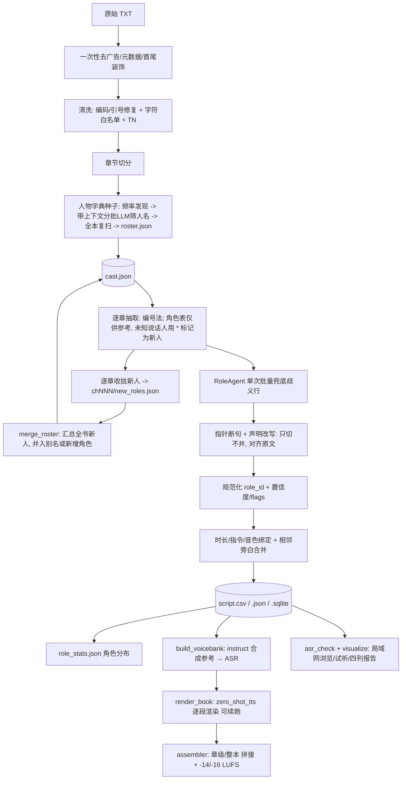

# 小说整本 → 有声书 工作流

核心原则：**把全部不确定性前置到「剧本」，渲染端退化成无状态纯函数**。渲染时不再做 ASR / 角色判断 / 时长估算，出错一定能定位到剧本某一行。面向 AuK 开发，指令模板与 AuK 现有任务对齐。

> 状态：前端（清洗 → 人物字典 → 逐章抽取/断句 → 剧本 → 统计）与后端（voicebank → 逐段渲染 → 组装）均已实现；正在整本跑。
> **全流程入口**：`scripts/run_book.py`（prepare → roster → script → render → report，可续跑）。
> 各阶段 CLI：`scripts/build_book.py`（清洗切章 + 逐章剧本）、`scripts/finalize_roster.py`（人物字典）、`scripts/build_script.py`（单章/单文件）、`scripts/render_book.py`（渲染组装）、`scripts/role_stats.py`、`scripts/build_voicebank.py`、`scripts/asr_check.py`。Web 面板：`scripts/serve_pipeline.py`。

> ⚠️ **适用范围**：本流水线目前只在一部**中文网文**（本地示例语料；`·`全名、大量配角、亲属/头衔称呼）上验证过。**换小说必须重写/调整"人物脚本"相关内容**：`scripts/finalize_roster.py` 的 `CLASSIFY_SYSTEM`/`ENRICH_SYSTEM`/`MERGE_SYSTEM`（人名判定与别名规则、示例），以及 `audiobook/extract.py::NUMBERED_SYSTEM` 的角色表用法与示例；然后**重建人物字典**（`--stages roster`）再跑剧本。清洗/抽取/断句/渲染等非人物逻辑是通用的。

## 1. 术语表

| 术语 | 英文 | 定义 |
| --- | --- | --- |
| 语料清洗 | Corpus Cleaning | 编码探测、换行统一、去页眉页脚、引号修复 |
| 字符白名单 | TTS Char Filter | 只留可朗读字符（字母/数字/标点），去 emoji/装饰/符号，LLM 之前生效 |
| 章节切分 | Chapter Split | 按「第X章/卷/节」等标题切分 |
| 文本规范化 | Text Normalization (TN) | 标点规范化，转可朗读文本；保留 `raw_text` |
| 人物字典 | Roster | 全书人物：规范名、别名、`scan_names`、性别、特点、声线 |
| 卡司 | Cast / Role Registry | 抽取用的全局唯一 `role_id`、别名、音色档案（由 roster `to_cast` 而来） |
| 角色规范化 | Role Canonicalization | 把同一角色被拆开的多个 `role_id` 归一 |
| 最小句 | Minimal Unit | 引号感知切出的「引号内 / 引号外」句段（编号后交给 LLM） |
| 话语单元 | Utterance Unit (U) | 同角色同 kind 的连续句段合并结果 |
| 剧本 | Script / Storyboard | 有序 U 表（CSV/SQLite），承载全部合成字段 |
| 角色分布 | Role Distribution | 只统计「会说话」角色；有名字但无对白者排除 |
| 音色库 | Voice Bank | 每个角色一段「性格描述+台词」合成参考 + ASR |
| 指令渲染 | Instruction Rendering | 按 AuK 模板机械拼出 `pe_instruction` |
| 渲染 | Rendering | `row → wav`，纯函数、无 NLP、可续跑 |
| 组装/母带 | Assembly / Mastering | 按序拼接、边界 gap、响度归一 |

## 2. 主流程图



## 3. 阶段细化（对照当前代码）

0. **一次性去广告**：站点页眉页脚/版权/书名/作者/内容简介/首尾 `-----===` 装饰块，在**输入 txt 层面删一次**（本地示例语料即如此，产物 `assets/txt/novel.txt`）。这一步不做成通用逻辑，因为每本书的站点噪声不同。
1. **清洗**（`cleaning.py::read_text/normalize_text`）：编码探测（UTF-8/GBK/Big5/UTF-16）、去 `----第N页----`、空行压缩、`repair_quotes`（ASCII 引号→中文、按段补全未闭合引号）。
2. **字符白名单 + TN**（`textnorm.py::clean_for_llm`）：`filter_tts_chars` 只保留 **L/N/P/M 类**（字母/数字/标点/组合符，覆盖中英日韩）+ 空白，另显式丢弃 `※§¶†‡•‣‧‰′″‹›` 等非朗读装饰标点；再 `normalize_tts` 规范 `……→…`、`——→，`、重复标点。产物 `clean.txt`。**这是通用持久逻辑，LLM 之前生效。**
3. **章节切分**（`cleaning.split_chapters`）：正则匹配 `第X[章节回卷篇部]` / `Chapter N` / `序章/前言/番外`；标题行从正文剔除；无标题则整本一章。
4. **人物字典（种子）**（`scripts/finalize_roster.py` + `namefinder.py` + `roster.py`）：这不是最终名单，只是给逐章抽取的**参考**。
   - 频率发现：`namefinder.discover` 全书 n-gram（频次/内聚 PMI/左右邻熵）；
   - 确定性预筛：`split_keywords` + `looks_non_person` 去掉家族姓、地名/组织后缀、虚词/停用词；
   - LLM 筛人名（带**上下文片段**）：分批强制逐条判断人物/非人物，输出规范名 + 别名；
   - 二次验证 `enrich`（带上下文、**非破坏**，每人必出一条）：确认 + 补全 `aliases` + `scan_names` + gender + traits；
   - 人名反查：`scan_chapters` 用 `scan_names`+`aliases` 全书复扫，静默出场也计入 `chapters`；
   - `finalize` 按性别分配声线（跳过重复旁白、剔除姓氏型 scan）→ `roster.json`；`to_cast` → `cast.json`。
5. **逐章抽取（编号法）**（`extract.py`）：Python 把整章按**引号边界**切成最小句并编号；LLM 只回 `{"speakers":{编号:角色}}`。**角色表仅供参考**：表中有的对号入座；表中没有的说话人用 `*名字` **标注为新人**（`new_role`），绝不留空。结构规则由代码保证：引号外一律旁白（**消灭串味**）、引号内完全未标 → `dialogue + unresolved_role`、极短台词不漏。文本永远是原文切片（fidelity=1.0）。
5b. **逐章收拢新人**（`build_book._build_chapter`）：把本章 `new_role` 行的名字写成 `chNNN/new_roles.json`（按章收集，便于续跑与汇总）。
6. **多章合并人物**（`scripts/merge_roster.py`）：汇总全书 `chNNN/new_roles.json` → 去重/计数 → 带上下文交 LLM **并入现有角色（作为别名）或新增为新人物** → 重扫章节 → 重写 `roster.json`/`cast.json`。渲染时会按合并后的卡司给 `new_role` 行补 `voice_ref`。
6b. **歧义兜底**（`agent.py::RoleAgent`）：对上一步仍为 `unresolved_role` 的行做**单次批量**判定，候选来自角色表（新角色会在合并后进入下一轮）。
7. **指针断句 + 声明改写**（`segment.py::segment_units`）：>6s 的单元按语义窗口送 agent，每段回 `next`（下段原文 6–10 字锚点）与可选 `speech`；Python 按锚点切回原文、校验「字序列一致」（骨架匹配，容忍标点差异），失败回退确定性切分；**只切分、不新增标点**，对白若被改字则回退原文（`dialogue_reverted`）。
8. **规范化**（`canonical.py::canonicalize_rows`）：按卡司解析（exact/alias/fuzzy）+ 核心名包含关系，把同一角色被拆开的 `role_id` 归一。
9. **相邻旁白合并**（`postprocess.merge_adjacent_narration`）：同章同角色、无阻断 flag、合并后 ≤ `TTS_MAX_SECONDS`（默认 20s）才并。
10. **剧本输出**：`script.csv`（真源）+ `script.json` + `script.sqlite`、`qa_report.json`（flags 汇总）、`role_stats.json`（角色分布）。
11. **音色库**（`voicebank.py`）：无真人素材时，用 `style_desc` + 首句范例走 `instruct_tts` 造参考音 → faster-whisper ASR 出参考文本 → 之后 `zero_shot_tts` 克隆它。
12. **渲染**（`renderer.py`）：`zero_shot_tts` 逐行 → `render/rows/<seg_id>__<hash>.wav`，**可续跑**（hash 命中即跳过）。
13. **组装**（`assembler.py`）：按 kind/角色切换插入 gap，响度 -14/-16 LUFS、峰值 ≤0.95、24 kHz PCM16。
14. **体检/报告**（`asr_check.py` + `visualize_script.py`）：拼音 coverage/score（仅观察，不自动重做）、四列对照 HTML。

> 已删除的旧路径 / 实验代码（负结果与思路记录在 `docs/prep-experiments.md`）：`cast.discover_cast`（抽样发现）、人名实验（`discover_names / tag_persons / scan_persons / clean_persons / roster_miner / roster_features / build_roster`）、demo/探针/基准（`segment_demo / voice_demo / probe_llm_len / bench_prep / bench_rounds / instruction_probe`）。`build_script` 无 `--cast` 时退化为「仅旁白」。

## 4. 预处理：通用字符白名单

`textnorm.filter_tts_chars` 按 Unicode 类别保留 **L(字母) / N(数字) / P(标点) / M(组合符)**，丢弃 S(符号)、C(控制/格式)、Z 中非空白；再显式丢一批「是标点但不可朗读」的装饰符。结果：Emoji、`★☆※`、制表框线、`×√￥○°`、零宽字符等都不会进 LLM。实测该 6.64M 字语料仅删 294 字符（`=~+×√￥○°`），正文零损伤。

`clean_for_llm = normalize_tts(filter_tts_chars(text))`，在 `pipeline.build_script`、`serve_pipeline.step_import`、`finalize_roster` 中统一调用。

## 5. 单元粒度与分句规则

- `extract._minimal_units` 以**引号深度**切最小句：开引号前 flush 叙述；闭引号后 flush 对白；引号内遇弱标点**不切**。
- 编号交给 LLM 后，`_numbered_extract` 由代码判定：引号外→旁白；引号内已标→对白；未标/未知→`dialogue + unresolved_role`；标成「旁白」且不以 `！？…` 结尾→非台词引文。
- `_append_unit` 把同 `kind`+`role_id` 的连续单元合并；无字母数字的纯标点碎片丢弃。
- 时长/长度：`MAX_SEGMENT_SECONDS=20`（标准秒）；估算 `≤20s`，超长只切不并（`duration.segment_tts_text`，弱标点结尾补 `。`，`punct_edited=True`）。

## 6. 时长估算

以 `app/infer_gradio.py` 的本地估算器为准（`audiobook/duration.py` 镜像，保持同步）：

| 项 | 系数 |
| --- | --- |
| 中文字 | 0.22 s/字 |
| 英文词 | 0.40 s/词 |
| 强停顿 `。！？!?…` | 0.30 s |
| 弱停顿 `，、；：,;:` | 0.12 s |
| 每字/词加成 | ×1.05 |
| ≤12 字短句 | ×1.10 |
| 全局标准率 | ×0.7（已内化） |

`target_duration_s = estimate_text_duration(tts_text)`，直接作为 AuK `gen_seconds`（`duration_source=est`）。渲染端不再算时长。参考音**收紧到 0.8×**（见 §8.4）。

## 7. 指令渲染与音色

### 7.1 指令

- 所有角色（含 `narrator`）统一走 **`zero_shot_tts`** + 固定参考音频（`instruct_tts` 音色随机，不能固定角色）。
- 机械模板（`instructions.py`）：
  - 克隆：`Say the following with the same voice: "{text}"`
  - 文本合成（仅用于造参考音）：`请基于下面的描述: "{style_desc}",生成语音内容"{text}".`
  - 情感：`将情感转变为{emotion}。`
- `pe_instruction` 在剧本阶段定稿，渲染端只读。

### 7.2 音色库（`voicebank.py`）—— 无真人素材的引导法

1. 用角色的 `style_desc`（缺省 `description`）+ 其**第一句范例台词**，走 `instruct_tts` 合成参考音；
2. faster-whisper ASR 出参考文本；
3. 之后该角色所有行都用 `zero_shot_tts` **克隆这段参考音**。

产物：`references/<role_id>.wav`、`voicebank.json`、`voicebank_meta.json`。`build_voicebank.py --script script.csv` 只给「会说话的角色」造参考音。

### 7.3 参考音优化与输出响度（实测 2026-09-13）

- **AuK 无音量/响度入参**：克隆输出电平很低（参考 -13 LUFS → 克隆 **-38 LUFS**）。对策：自己归一。`RenderConfig.target_lufs`（默认 -16）逐行归一，assembler 母带同样；峰值 ceiling 0.95，测不出响度时回退峰值归一。
- **参考音优化只能用 bwe**（`improve_quality/bandwidth_extension`），电平稳定。
- **AuK 去混响是坏的**（输出近静音 -42 LUFS），降噪收益仅 ~1.3dB；结论：参考音 = `prepare_refs.py`（VAD 去内部静音 + 去首尾静音 + 归一 + ≤12s）+ `optimize_refs.py`（bwe），**不**做 AuK 降噪/去混响。

**参考音规范**：24 kHz 单声道、≤12s，5–12s 为宜（<3s 音色不稳）。真实资产经 `scripts/prepare_refs.py` + `scripts/optimize_refs.py` → `outputs/refs_bwe`。

### 7.4 语气词停顿与时长甜点

- 耗时过松会让模型用内部静音填满多余时长；收紧到 **≈0.80×** 甜点，多余停顿全消、文本完整。
- 别在语气词前插空格（tokenizer 会退化成字节回退 token）。默认 `RenderConfig.duration_rate=0.8`。

### 7.5 负结果

- **不能用自由指令控制克隆情绪/风格**：往零样本指令里加“terrified/angry”等，模型会把指令前缀当台词念出来。情绪只能走 `emotion_edit` 后编辑（复现脚本已随实验清理删除，记录见 `docs/prep-experiments.md`）。
- **参考音质量是天花板**：TTS 合成音色作参考，克隆会放大其瑕疵（多余停顿/生硬），VAD+bwe+收紧时长都无法根治。要自然必须换更高质量参考音。

## 8. 情绪（进阶，尚未接线）

- 生成期无独立情绪参数；情绪一律走 AuK `emotion_edit` 后编辑。
- 合法值：`happy/angry/sad/fearful/surprised/disgusted/calm/excited`。
- `equal_length` 且带系数：`sad 1.22`、`fearful 1.16`、其余 `1.06`。
- 剧本预留：`emotion`、`emotion_multiplier`、`base_seg_id`。

## 9. 剧本 Schema（`script.csv`，真源）

字段见 `audiobook/schema.py::ScriptRow`。关键列：`order`、`chapter_id`/`chapter_title`、`seg_id`、`kind`、`role_id`/`role_name`、`raw_text`/`tts_text`、`punct_edited`、`auk_task`、`voice_ref`、`style_desc`、`emotion`/`emotion_multiplier`/`base_seg_id`、`target_duration_s`/`duration_source`、`pe_instruction`、`seed`/`nfe`/`cfg`、`extract_conf`/`needs_pass2`、`prompt_id`/`prompt_hash`/`model_id`、`flags`/`notes`。同时导出 `script.json`、`script.sqlite`。

## 10. 提示词策略

- **抽取定型为编号法**：LLM 只为引号句输出说话人编号，不复述原文；文本 bit-exact、输出极小。
- 抽取默认 `thinking off` + JSON 模式（失败自动回退 `thinking on`）；`agent` 用 `thinking on`。
- 人物字典提示词分两段：**分批 `只回编号`** 选人名 + 一次 `merge` 汇总别名/`scan_names`；抽取提示词内联角色表（`roster_block`）。
- 每行记录 `prompt_id/prompt_hash/model_id`；LLM 调用缓存于 `.cache/llm/<hash>.json`（`AUDIOBOOK_LLM_CACHE`），**重复运行命中缓存**。
- 本地模型默认 `Spark-X2.5-4B`（`ckpts/llm/Spark-X2.5-4B-Q8_0.gguf`，profile `spark-4b`）；备选 `Ornith-1.5-9B`、`gemma-4-E4B/E2B`。profile 见 `audiobook/models.py`。

## 11. 角色分布（`stats.py` / `role_stats.py`）

- **只统计「会说话」角色**：旁白（叙述）+ 至少有一条 `dialogue/monologue` 的角色。
- **有名字但从不说话的排除**，单列 `non_speaking_named`（含 `mentions`）。
- 统计前会 `canonicalize_rows`，保证同一角色不拆。

## 12. 目录与产物

```
outputs/<book>/
  source.txt                   # normalize_text 后全文（审计）
  clean.txt                    # 白名单+TN 后全文
  chapters/chNNN.txt           # 章节文本
  roster.json                  # 全书人物字典
  cast.json                    # 抽取用卡司（由 roster to_cast）
  script.csv / .json / .sqlite # 剧本（真源）
  qa_report.json               # flags 汇总
  role_stats.json              # 角色分布
  references/<role_id>.wav     # 音色库参考音
  voicebank.json / _meta.json
  render/rows/*.wav            # 逐段渲染（可续跑）
  render/chapters/chNNNN.wav   # 章级母带
  render/book.wav              # 整本母带
  render/render_manifest.json
```

> 输出一律写项目内 `outputs/`；`outputs/` 与 `.cache/` 已在 `.gitignore`。

## 13. 全本运行（`scripts/run_book.py`，可续跑）

单一入口，按阶段可单独跑/续跑；LLM 阶段自动起停本地 llama.cpp（渲染前停掉释放显存）：

```bash
# 全流程：清洗切章 -> 人物字典 -> 逐章剧本 -> 渲染组装
python scripts/run_book.py assets/txt/novel.txt --book mybook

# 只跑某些阶段 / 小样本验证
python scripts/run_book.py assets/txt/novel.txt --book mybook --stages prepare,roster
python scripts/run_book.py assets/txt/novel.txt --book mybook --stages script --limit 5
python scripts/run_book.py assets/txt/novel.txt --book mybook --stages render
```

- 阶段：`prepare`（`build_book.py` 清洗切章）/ `roster`（`finalize_roster.py` 种子字典）/ `script`（`build_book.py` 逐章抽取+合并剧本）/ `merge`（`merge_roster.py` 汇总逐章新人并入字典）/ `render`（`render_book.py`）/ `report`。
- **续跑单位**：字典整体；剧本以**章**为单位（`chNNN/script.csv` 存在即跳过）；渲染以**行为**单位（`render/rows/<hash>.wav` 命中即跳过）。LLM 调用缓存于 `.cache/llm/`，重跑几乎零成本。
- 长任务必须后台脱离会话（`setsid --fork nohup … </dev/null > log 2>&1 & disown`），轮询日志。

## 14. 局域网浏览（`scripts/serve_files.py`）

- 纯标准库 HTTP 文件浏览器 + 内嵌 H5 `<audio>` 播放，支持 **Range**（大 wav 可拖动）。
- 文本文件统一转 UTF-8 并声明 charset（兼容原始 GBK 小说）。
- 开机自启：systemd `auk-files.service`，默认 `http://<LAN-IP>:8899/`。

## 15. 待办

- **全本跑通**：1595 章剧本 + 渲染（当前规模）。
- **成品导出**：wav → m4a。
- **卡司质量**：LLM 合并仍偶发漏并/错并；可加人工校对与二次校验。
- **音色库质量**：`instruct_tts` 参考音偶有发音/识别偏差，可换更贴切的 `style_desc` / 更高质量参考音。
